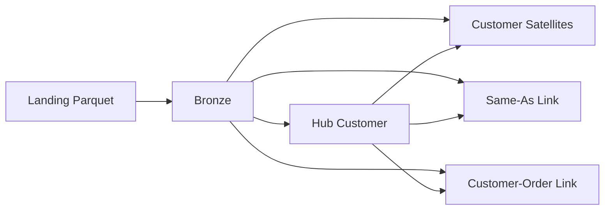
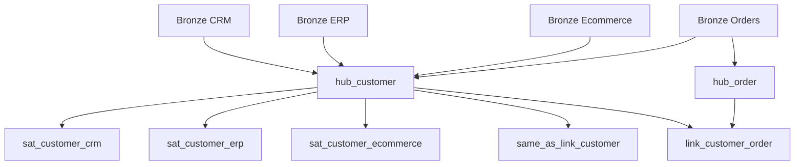

# Fluxo de Customer de ponta a ponta

Este documento acompanha uma cliente fictícia, Ana Silva, desde os arquivos de
origem até a camada Silver em Raw Data Vault.

## Visão geral



O fluxo tem três objetivos:

1. preservar os dados recebidos de cada sistema;
2. manter a identidade e o histórico de cada cliente;
3. registrar quando identidades diferentes representam a mesma pessoa.

---

## 1. Dados recebidos na Landing

Ana existe em três sistemas, mas cada sistema usa um ID diferente.

### CRM

Arquivo:

```text
vault/crm/customers/2026/07/27/customers.parquet
```

| crm_customer_id | full_name | cpf | email | city | status |
|---|---|---|---|---|---|
| `CRM-100` | Ana Silva | `12345678900` | `ana@email.com` | São Paulo | ACTIVE |

### ERP

Arquivo:

```text
vault/erp/customers/2026/07/27/customers.parquet
```

| erp_customer_id | customer_name | cpf | invoice_email | credit_limit |
|---|---|---|---|---:|
| `ERP-900` | ANA SILVA | `12345678900` | `ana@email.com` | 5000.00 |

### E-commerce

Arquivo:

```text
vault/ecommerce/customers/2026/07/27/customers.parquet
```

| ecommerce_customer_id | display_name | email_address | newsletter_optin |
|---|---|---|---|
| `ECOM-300` | Ana | `ana@email.com` | true |

Nesse momento existem três IDs:

```text
CRM-100
ERP-900
ECOM-300
```

Os arquivos não possuem uma chave global dizendo que os três registros são da
mesma pessoa.

---

## 2. Ingestão para a Bronze

O Auto Loader executa uma task para cada fonte:

```text
crm_customers
erp_customers
ecommerce_customers
```

Ele copia os dados para tabelas Delta e adiciona metadados técnicos.

### Linha em `bronze.crm_customers`

| crm_customer_id | full_name | cpf | city | status | _source_system | _source_date | _ingested_at |
|---|---|---|---|---|---|---|---|
| `CRM-100` | Ana Silva | `12345678900` | São Paulo | ACTIVE | crm | 2026-07-27 | 2026-07-27 20:00 |

### Linha em `bronze.erp_customers`

| erp_customer_id | customer_name | cpf | credit_limit | _source_system | _source_date | _ingested_at |
|---|---|---|---:|---|---|---|
| `ERP-900` | ANA SILVA | `12345678900` | 5000.00 | erp | 2026-07-27 | 2026-07-27 20:02 |

### Linha em `bronze.ecommerce_customers`

| ecommerce_customer_id | display_name | email_address | newsletter_optin | _source_system | _source_date | _ingested_at |
|---|---|---|---|---|---|---|
| `ECOM-300` | Ana | `ana@email.com` | true | ecommerce | 2026-07-27 | 2026-07-27 20:04 |

A Bronze:

- preserva as colunas da origem;
- não junta clientes;
- não escolhe o melhor nome ou e-mail;
- registra arquivo, sistema e momento da ingestão;
- permite reprocessar apenas arquivos novos através do checkpoint.

---

## 3. Criação do `hub_customer`

O Hub guarda somente identidade e auditoria. Os atributos descritivos ficam nos
Satellites.

Antes do hash, cada Business Key é combinada com o contexto do sistema:

```text
CRM||CRM-100
ERP||ERP-900
ECOMMERCE||ECOM-300
```

Depois é aplicado SHA-256:

```text
customer_hk = SHA256(contexto || business_key)
```

Para facilitar a leitura, os hashes abaixo estão abreviados.

| customer_hk | customer_bk | business_key_context | load_datetime | record_source |
|---|---|---|---|---|
| `HK-CRM-100` | `CRM-100` | CRM | 2026-07-27 20:00 | crm |
| `HK-ERP-900` | `ERP-900` | ERP | 2026-07-27 20:02 | erp |
| `HK-ECOM-300` | `ECOM-300` | ECOMMERCE | 2026-07-27 20:04 | ecommerce |

O Hub possui três linhas, e não uma. Isso preserva a identidade original de
cada sistema.

Se a carga for executada novamente, o `MERGE` encontra os mesmos
`customer_hk` e não insere duplicatas.

---

## 4. Criação dos Customer Satellites

Cada fonte possui um Satellite próprio.

### `sat_customer_crm`

| customer_hk | full_name | cpf | email | city | status | hashdiff | load_datetime |
|---|---|---|---|---|---|---|---|
| `HK-CRM-100` | Ana Silva | `12345678900` | `ana@email.com` | São Paulo | ACTIVE | `HD-CRM-A` | 2026-07-27 20:00 |

### `sat_customer_erp`

| customer_hk | customer_name | cpf | invoice_email | credit_limit | hashdiff | load_datetime |
|---|---|---|---|---:|---|---|
| `HK-ERP-900` | ANA SILVA | `12345678900` | `ana@email.com` | 5000.00 | `HD-ERP-A` | 2026-07-27 20:02 |

### `sat_customer_ecommerce`

| customer_hk | display_name | email_address | newsletter_optin | hashdiff | load_datetime |
|---|---|---|---|---|---|
| `HK-ECOM-300` | Ana | `ana@email.com` | true | `HD-ECOM-A` | 2026-07-27 20:04 |

O `hashdiff` representa todos os atributos daquela versão. Se um atributo
mudar, o hashdiff também muda.

---

## 5. Criação do `same_as_link_customer`

O Same-As Link procura evidências exatas entre identidades de sistemas
diferentes.

### Evidências encontradas

| customer_hk | contexto | match_rule | match_value |
|---|---|---|---|
| `HK-CRM-100` | CRM | EXACT_CPF | `12345678900` |
| `HK-ERP-900` | ERP | EXACT_CPF | `12345678900` |
| `HK-CRM-100` | CRM | EXACT_EMAIL | `ANA@EMAIL.COM` |
| `HK-ECOM-300` | ECOMMERCE | EXACT_EMAIL | `ANA@EMAIL.COM` |

Os valores são normalizados com `trim` e `upper`.

### Links criados

| same_as_customer_hk | customer_hk_left | customer_hk_right | match_rule | match_score | match_status |
|---|---|---|---|---:|---|
| `SAL-1` | `HK-CRM-100` | `HK-ERP-900` | EXACT_CPF | 1.0 | AUTO_MATCHED |
| `SAL-2` | `HK-CRM-100` | `HK-ECOM-300` | EXACT_EMAIL | 1.0 | AUTO_MATCHED |

O Same-As Link não apaga nem consolida as três linhas do Hub. Ele registra que
elas pertencem ao mesmo grupo de identidade.

Nomes não são usados como correspondência automática porque pessoas diferentes
podem ter o mesmo nome.

---

## 6. Relacionamento entre Customer e Order

Ana faz um pedido no ERP:

### Linha em `bronze.erp_orders`

| order_id | erp_customer_id | order_status | order_purchase_timestamp |
|---|---|---|---|
| `ORDER-500` | `ERP-900` | CREATED | 2026-07-27 21:00 |

Primeiro, `ORDER-500` é inserido em `hub_order`:

| order_hk | order_bk | business_key_context |
|---|---|---|
| `HK-ORDER-500` | `ORDER-500` | ERP |

Depois é criado o relacionamento:

```text
customer_order_hk = SHA256(customer_hk || order_hk)
```

### Linha em `link_customer_order`

| customer_order_hk | customer_hk | order_hk | load_datetime | record_source |
|---|---|---|---|---|
| `LINK-1` | `HK-ERP-900` | `HK-ORDER-500` | 2026-07-27 21:05 | erp |

Agora é possível navegar:

```text
pedido ORDER-500
  → cliente ERP-900
  → mesma pessoa que CRM-100
  → mesma pessoa que ECOM-300
```

---

## 7. Chegada de uma carga incremental

No dia seguinte, o CRM envia uma nova versão:

| crm_customer_id | full_name | cpf | city | status |
|---|---|---|---|---|
| `CRM-100` | Ana Silva | `12345678900` | Rio de Janeiro | ACTIVE |

A única mudança foi:

```text
city: São Paulo → Rio de Janeiro
```

### Bronze

A nova linha é adicionada, sem alterar a anterior:

| crm_customer_id | city | _source_date | _ingested_at |
|---|---|---|---|
| `CRM-100` | São Paulo | 2026-07-27 | 2026-07-27 20:00 |
| `CRM-100` | Rio de Janeiro | 2026-07-28 | 2026-07-28 20:00 |

### Hub

Nada é inserido. A identidade `CRM||CRM-100` já existe:

| customer_hk | customer_bk | quantidade |
|---|---|---:|
| `HK-CRM-100` | `CRM-100` | 1 |

### Satellite

O novo conjunto de atributos produz outro hashdiff:

| customer_hk | city | hashdiff | load_datetime |
|---|---|---|---|
| `HK-CRM-100` | São Paulo | `HD-CRM-A` | 2026-07-27 20:00 |
| `HK-CRM-100` | Rio de Janeiro | `HD-CRM-B` | 2026-07-28 20:00 |

As duas versões são preservadas.

### Same-As Link

Nada novo é inserido porque a relação `CRM-100 ↔ ERP-900` já existe.

---

## 8. Carga incremental sem mudança

No terceiro dia, o CRM envia exatamente os mesmos atributos:

| crm_customer_id | city | status |
|---|---|---|
| `CRM-100` | Rio de Janeiro | ACTIVE |

O hashdiff calculado continua sendo:

```text
HD-CRM-B
```

Como é igual à versão anterior, o Satellite ignora essa linha.

Resultado:

| Data recebida | Estado | Inserido no Satellite? |
|---|---|---|
| 27/07 | São Paulo | Sim |
| 28/07 | Rio de Janeiro | Sim |
| 29/07 | Rio de Janeiro | Não |

---

## 9. Ordem de execução no Job



Os Satellites e o Same-As Link só iniciam depois de `hub_customer`. O
`link_customer_order` espera tanto `hub_customer` quanto `hub_order`.

---

## 10. Consultas de validação

### Identidades do cliente

```sql
SELECT *
FROM lakehouse.silver.hub_customer
WHERE customer_bk IN ('CRM-100', 'ERP-900', 'ECOM-300');
```

### Histórico do CRM

```sql
SELECT
    hub.customer_bk,
    sat.city,
    sat.status,
    sat.load_datetime
FROM lakehouse.silver.hub_customer AS hub
INNER JOIN lakehouse.silver.sat_customer_crm AS sat
    ON hub.customer_hk = sat.customer_hk
WHERE hub.customer_bk = 'CRM-100'
ORDER BY sat.load_datetime;
```

### Identidades equivalentes

```sql
SELECT *
FROM lakehouse.silver.same_as_link_customer
WHERE customer_hk_left = 'HK-CRM-100'
   OR customer_hk_right = 'HK-CRM-100';
```

Os exemplos usam hashes abreviados para facilitar a leitura. Nas tabelas reais,
os campos `*_hk` e `hashdiff` contêm hashes SHA-256 completos.

---

## Resumo

| Etapa | O que acontece com Ana? |
|---|---|
| Landing | Três sistemas entregam três registros e três IDs |
| Bronze | Os registros são preservados com metadados técnicos |
| Hub | Cada identidade de origem recebe um Hash Key |
| Satellites | Os atributos são separados por fonte e versionados |
| Same-As Link | CPF e e-mail relacionam as identidades equivalentes |
| Customer-Order Link | O cliente ERP é relacionado ao pedido |
| Incremental | O Hub não duplica e o Satellite grava somente mudanças |


