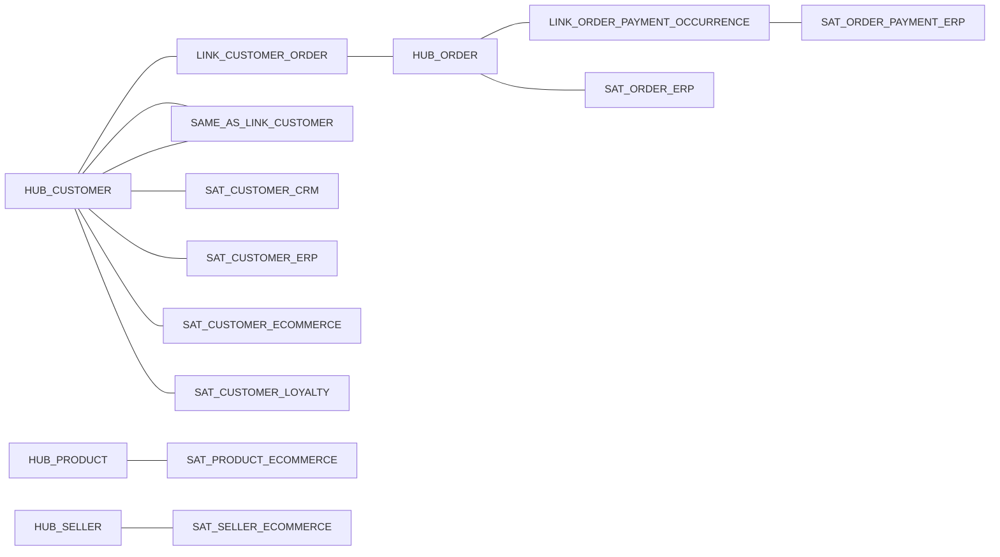

# Silver Raw Data Vault

The Silver layer converts the eight Bronze datasets into an insert-only Raw
Data Vault. Run `05_silver_raw_vault.py` directly or deploy the
`silver_raw_vault` Databricks Asset Bundle job.

## Objects

| Type | Table | Source |
|---|---|---|
| Hub | `hub_customer` | CRM, ERP, e-commerce and loyalty customer identities |
| Hub | `hub_order` | ERP orders and payments |
| Hub | `hub_product` | E-commerce products |
| Hub | `hub_seller` | E-commerce sellers |
| Link | `link_customer_order` | ERP orders |
| Link | `link_order_payment_occurrence` | ERP payments |
| Same-As Link | `same_as_link_customer` | Exact CPF and e-mail evidence |
| Satellite | `sat_customer_crm` | CRM customer attributes |
| Satellite | `sat_customer_erp` | ERP customer attributes |
| Satellite | `sat_customer_ecommerce` | E-commerce customer attributes |
| Satellite | `sat_customer_loyalty` | Loyalty attributes |
| Satellite | `sat_order_erp` | Order attributes |
| Satellite | `sat_order_payment_erp` | Payment attributes |
| Satellite | `sat_product_ecommerce` | Product attributes |
| Satellite | `sat_seller_ecommerce` | Seller attributes |

## Model



Product and Seller remain isolated until an order-items source is introduced.

## Hashing

All hash keys and hashdiffs use SHA-256. Inputs are:

1. cast to string;
2. trimmed;
3. upper-cased;
4. replaced with `^^` when null;
5. joined with `||`.

Customer keys include a Business Key Context (`CRM`, `ERP`, `ECOMMERCE`, or
`LOYALTY`) because identifiers from different systems can have the same text
without representing the same identity.

## Loading behavior

- Hubs and Links use insert-only Delta `MERGE`.
- Satellites recreate the source sequence using the Bronze `_ingested_at`
  timestamp and retain only rows whose hashdiff changed.
- Re-running the notebook is idempotent.
- The Same-As Link uses only exact CPF or exact e-mail matches. Names are not
  used because they are not reliable identity evidence. Exact matches receive
  `match_score = 1.0` and `match_status = AUTO_MATCHED`.
- Payment is modeled as a dependent occurrence using
  `order_id + payment_sequential`; `payment_id` is not consistently present in
  the complete source history.

## Parameters

| Parameter | Default | Description |
|---|---|---|
| `bronze_catalog` | `poc` | Source Unity Catalog catalog |
| `bronze_schema` | `bronze` | Source schema |
| `silver_catalog` | `poc` | Target Unity Catalog catalog |
| `silver_schema` | `silver` | Target schema |

Deploy and run:

```bash
databricks bundle validate
databricks bundle deploy -t dev
databricks bundle run silver_raw_vault -t dev
```

